# Shell-scripting-mini-project.
## This project demonstrates how to create and execute shell scripts for performing repetitative tasks.

# Shell Scripting.

### Shell scripting is like writing a recipe for your computer to follow - it's a way to automate tasks by putting commands in a file that your operating system can execute. 

## Basic Components of a Shell Script.

* The Shebang (#!). This tells the system which interpreter to use, like specifying which chef will follow your recipe.

```bash
#!/bin/bash
```

* Commands. These are the actual instructions, like steps in your recipe.

* Variables. Containers to store information that might change.
```
COFFEE_TYPE ="Expresso"
PRICE=3.59
```
### Variable Example demo.

* Run `name="John"` to assign the value 'john' to the variabl 'name'

* Run `echo $name` to retrieve the value of the variable. Prefix variable name with '$'

* Run `echo My name is $name` to retrieve variable value along side string provided.

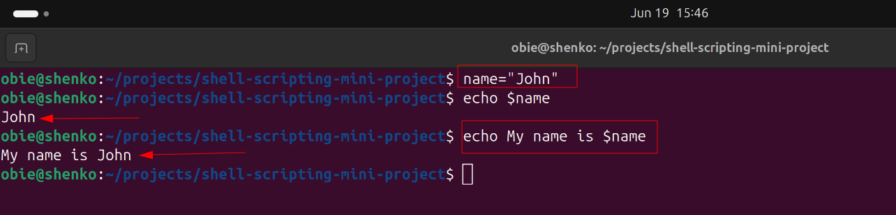

## Daily Backup Script.
### At the end of each day, you want to :
* Backup log data
* Move to safe location
* Clean uo temporary files

### Create a file backup.sh and add the content below.

[](./backup.sh)

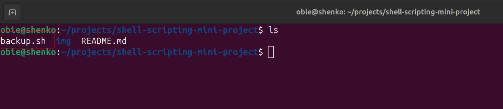


### Modify script file to permission to be able to execute the script. The script will create a folder named with today's date. Check if the folder has been created, then copy log from mysql and mongodb files into the folder.

* Run `chmod 700 backup.sh`

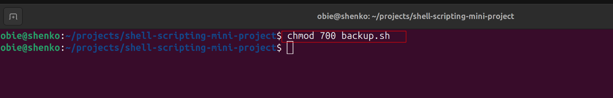

* List the directory to very files nad folder before executing the script.

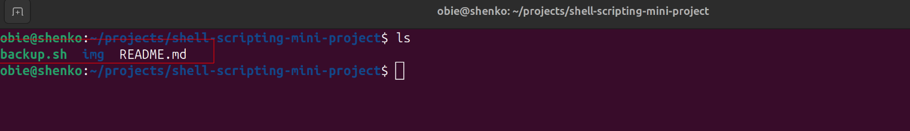

* Run `,/backup.sh` to execute the script.

* List the folder to verify execution of the script
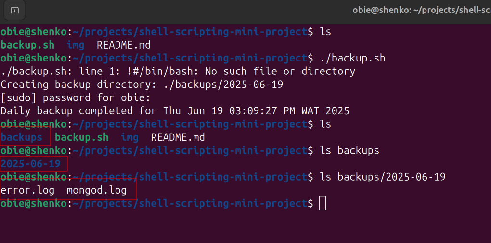

### You see that the script executed as desired and the log files are present in the desired folder.


## Task

* Use `mkdir` command to create a folder 'shell-scripting'

* Use `cd shell-scripting` to change to shell-scripting dir.

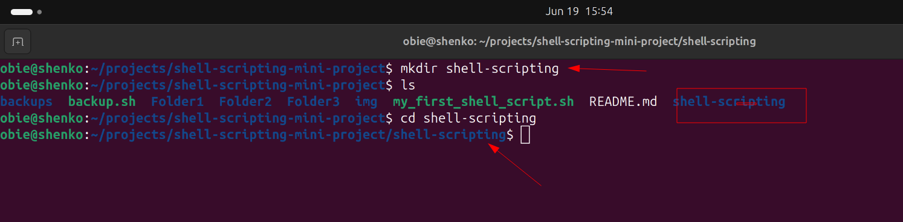

* Run `vim my_first_shell-script.sh` to create a .sh file 'my_first_shell-script.sh'

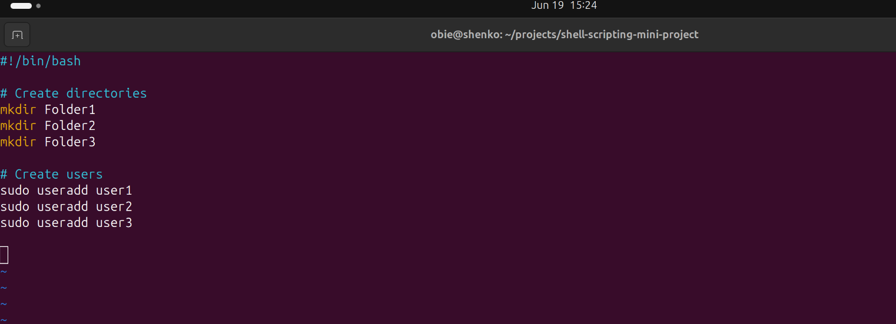

* Run `ls latr` to confirm file creation and file permission

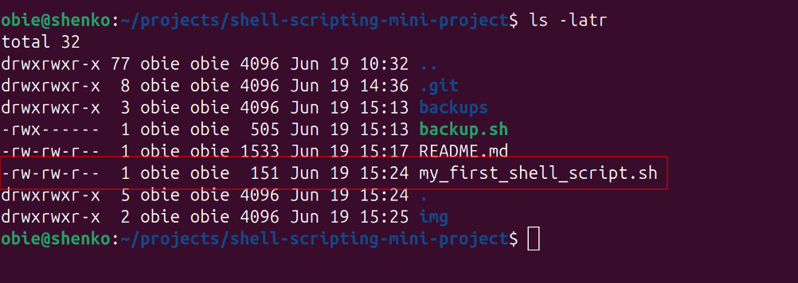

* Run `cat my_first_shell-script.sh` to verify file content

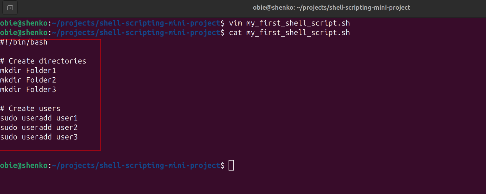

* Run `./my_first_shell_script.sh` to execute script.

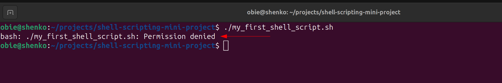

### Script did not run to permission issues. Owner had read, write permission but not execute permission.

* Run `chmod 700 ./my_first_shell_script.sh
` to give owner execute permission.

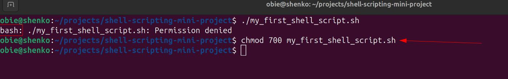

* Run `ls latr` to confirm file execute permission.

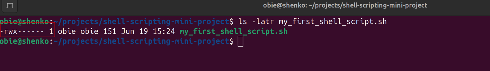

### Owner now has execute permission as shown above. Let's execute the script.

* Run `./my_first_shell_script.sh` to run the script again.

### List the directory to confirm if script was executed as desired.

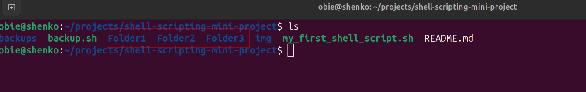

### Folders were created as desired in the script. Let us check if user were created as well.

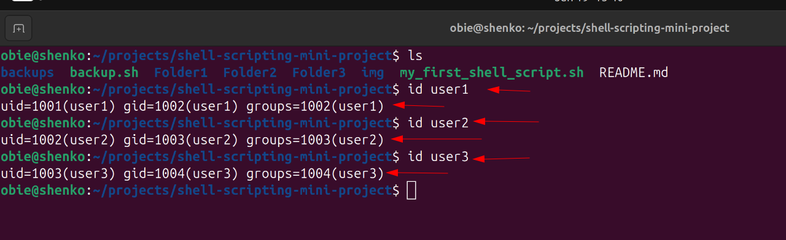

### User were created as shown above. The script executed as we wanted.
